# Phenosemantic-py Technical Reference
## Complete Standards & Architecture Guide

**Version:** 1.0  
**Date:** March 1, 2026  
**Author:** Rexuvia AI Agent  

---

## Table of Contents

1. [System Architecture](#system-architecture)
2. [Core Concepts](#core-concepts)
3. [Lexasome Standards](#lexasome-standards)
4. [Lexaplast Standards](#lexaplast-standards)
5. [Data Flow](#data-flow)
6. [Generation Modes](#generation-modes)
7. [API Integration](#api-integration)
8. [Output Format](#output-format)
9. [CLI Commands](#cli-commands)
10. [Integration Patterns](#integration-patterns)

---

## 1. System Architecture

### High-Level Component Diagram

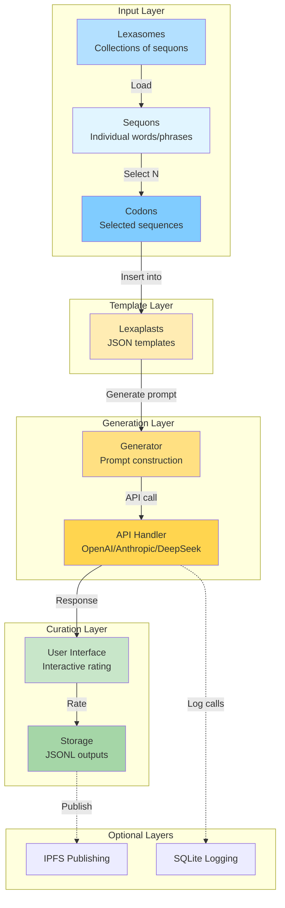
```mermaid
graph TB
    subgraph "Input Layer"
        SEQ[Sequons<br/>Individual words/phrases]
        LEX[Lexasomes<br/>Collections of sequons]
        COD[Codons<br/>Selected sequences]
    end
    
    subgraph "Template Layer"
        LEXAP[Lexaplasts<br/>JSON templates]
    end
    
    subgraph "Generation Layer"
        API[API Handler<br/>OpenAI/Anthropic/DeepSeek]
        GEN[Generator<br/>Prompt construction]
    end
    
    subgraph "Curation Layer"
        UI[User Interface<br/>Interactive rating]
        STORE[Storage<br/>JSONL outputs]
    end
    
    subgraph "Optional Layers"
        IPFS[IPFS Publishing]
        LOG[SQLite Logging]
    end
    
    LEX -->|Load| SEQ
    SEQ -->|Select N| COD
    COD -->|Insert into| LEXAP
    LEXAP -->|Generate prompt| GEN
    GEN -->|API call| API
    API -->|Response| UI
    UI -->|Rate| STORE
    STORE -.->|Publish| IPFS
    API -.->|Log calls| LOG
    
    style SEQ fill:#e1f5ff
    style LEX fill:#b3e0ff
    style COD fill:#80ccff
    style LEXAP fill:#ffecb3
    style GEN fill:#ffe082
    style API fill:#ffd54f
    style UI fill:#c8e6c9
    style STORE fill:#a5d6a7
```

### 4-Layer Architecture

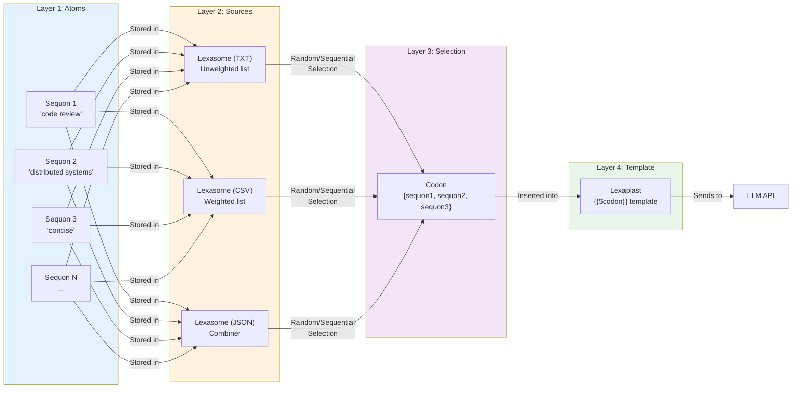
```mermaid
flowchart LR
    subgraph Layer1["Layer 1: Atoms"]
        S1["Sequon 1<br/>'code review'"]
        S2["Sequon 2<br/>'distributed systems'"]
        S3["Sequon 3<br/>'concise'"]
        S4["Sequon N<br/>..."]
    end
    
    subgraph Layer2["Layer 2: Sources"]
        LEX1["Lexasome (TXT)<br/>Unweighted list"]
        LEX2["Lexasome (CSV)<br/>Weighted list"]
        LEX3["Lexasome (JSON)<br/>Combiner"]
    end
    
    subgraph Layer3["Layer 3: Selection"]
        COD["Codon<br/>{sequon1, sequon2, sequon3}"]
    end
    
    subgraph Layer4["Layer 4: Template"]
        LEXAP["Lexaplast<br/>{{$codon}} template"]
    end
    
    S1 & S2 & S3 & S4 -->|Stored in| LEX1 & LEX2 & LEX3
    LEX1 & LEX2 & LEX3 -->|Random/Sequential<br/>Selection| COD
    COD -->|Inserted into| LEXAP
    LEXAP -->|Sends to| LLM["LLM API"]
    
    style Layer1 fill:#e3f2fd
    style Layer2 fill:#fff3e0
    style Layer3 fill:#f3e5f5
    style Layer4 fill:#e8f5e9
```

---

## 2. Core Concepts

### Biology-Inspired Terminology

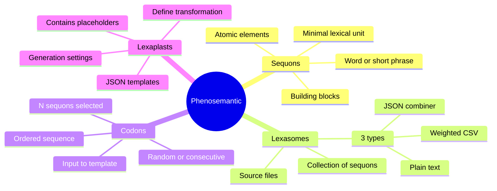
```mermaid
mindmap
    root((Phenosemantic))
        Sequons
            Minimal lexical unit
            Word or short phrase
            Building blocks
            Atomic elements
        Lexasomes
            Collection of sequons
            Source files
            3 types
                Plain text
                Weighted CSV
                JSON combiner
        Codons
            N sequons selected
            Ordered sequence
            Input to template
            Random or consecutive
        Lexaplasts
            JSON templates
            Define transformation
            Contains placeholders
            Generation settings
```

### Data Flow Overview

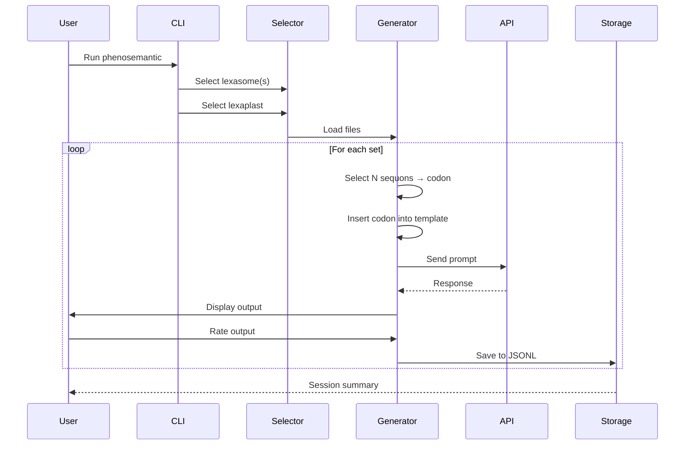
```mermaid
sequenceDiagram
    participant User
    participant CLI
    participant Selector
    participant Generator
    participant API
    participant Storage
    
    User->>CLI: Run phenosemantic
    CLI->>Selector: Select lexasome(s)
    CLI->>Selector: Select lexaplast
    Selector->>Generator: Load files
    
    loop For each set
        Generator->>Generator: Select N sequons → codon
        Generator->>Generator: Insert codon into template
        Generator->>API: Send prompt
        API-->>Generator: Response
        Generator->>User: Display output
        User->>Generator: Rate output
        Generator->>Storage: Save to JSONL
    end
    
    Storage-->>User: Session summary
```

---

## 3. Lexasome Standards

### Three Lexasome Types

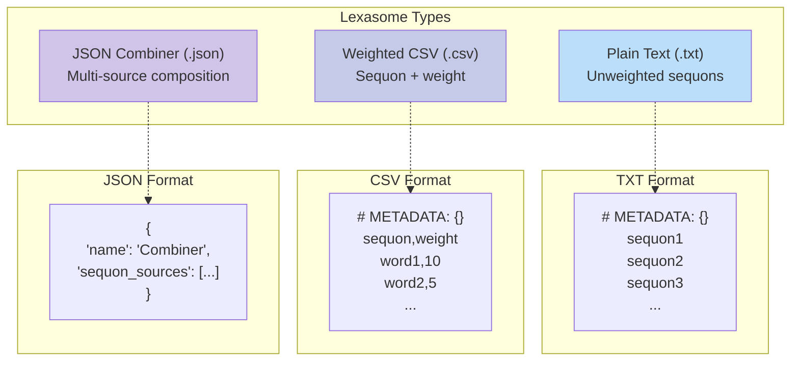
```mermaid
graph TB
    subgraph "Lexasome Types"
        TXT["Plain Text (.txt)<br/>Unweighted sequons"]
        CSV["Weighted CSV (.csv)<br/>Sequon + weight"]
        JSON["JSON Combiner (.json)<br/>Multi-source composition"]
    end
    
    subgraph "TXT Format"
        TXT_EX["# METADATA: {}<br/>sequon1<br/>sequon2<br/>sequon3<br/>..."]
    end
    
    subgraph "CSV Format"
        CSV_EX["# METADATA: {}<br/>sequon,weight<br/>word1,10<br/>word2,5<br/>..."]
    end
    
    subgraph "JSON Format"
        JSON_EX["{<br/>'name': 'Combiner',<br/>'sequon_sources': [...]<br/>}"]
    end
    
    TXT -.-> TXT_EX
    CSV -.-> CSV_EX
    JSON -.-> JSON_EX
    
    style TXT fill:#bbdefb
    style CSV fill:#c5cae9
    style JSON fill:#d1c4e9
```

### Lexasome Type 1: Plain Text (.txt)

**File Structure:**
```
# METADATA: {"name": "Example", "description": "...", "influences": [], "default_lexaplast": ""}
sequon_one
sequon_two
sequon_three
...
```

**Validation Rules:**
- Must have at least one non-empty, non-comment line
- Lines starting with `#` are treated as comments
- First line can be optional metadata (JSON in comment)
- Each line is one sequon

**Selection Behavior:**
- All sequons have equal probability
- Random or consecutive selection based on config

**Example:**
```
# METADATA: {"name": "Game Mechanics", "description": "Core game mechanics"}
platformer
puzzle
tower defense
rhythm game
physics simulation
```

### Lexasome Type 2: Weighted CSV (.csv)

**File Structure:**
```
# METADATA: {"name": "Example", "description": "..."}
sequon,weight
word_one,10
word_two,5
word_three,15
```

**Validation Rules:**
- Must have exactly 2 columns per row
- Second column must be an integer (weight)
- First row can be header or data
- Empty rows are skipped

**Selection Behavior:**
- Higher weight = higher probability
- Weight of 10 = 2x more likely than weight of 5

**Example:**
```
# METADATA: {"name": "Game Themes", "description": "Weighted themes"}
sequon,weight
sci-fi,15
fantasy,10
horror,8
abstract,12
historical,5
```

### Lexasome Type 3: JSON Combiner (.json)

**File Structure:**
```json
{
  "name": "Multi-source Combiner",
  "description": "Combines multiple sources",
  "format_version": "1.0",
  "influences": [],
  "sequon_sources": [
    {
      "file": "mechanics.txt",
      "weight": 1.0
    },
    {
      "static": "always include this",
      "weight": 1.0
    }
  ]
}
```

**Validation Rules:**
- Required keys: `name`, `sequon_sources`
- `sequon_sources` must be non-empty array
- Each source must have `file` OR `static` key
- Optional `weight` per source (default: 1.0)

**Selection Behavior:**
- Loads sequons from multiple referenced files
- Can include static sequons
- Weighted selection across all sources

**Combiner Source Types:**

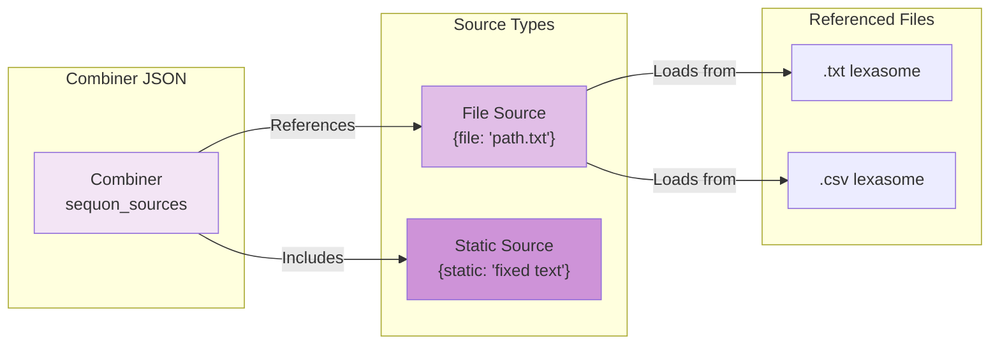
```mermaid
graph LR
    subgraph "Combiner JSON"
        C[Combiner<br/>sequon_sources]
    end
    
    subgraph "Source Types"
        F["File Source<br/>{file: 'path.txt'}"]
        S["Static Source<br/>{static: 'fixed text'}"]
    end
    
    subgraph "Referenced Files"
        TXT[".txt lexasome"]
        CSV[".csv lexasome"]
    end
    
    C -->|References| F
    C -->|Includes| S
    F -->|Loads from| TXT
    F -->|Loads from| CSV
    
    style C fill:#f3e5f5
    style F fill:#e1bee7
    style S fill:#ce93d8
```

### Metadata Format (All Types)

**Optional Metadata Header:**
```
# METADATA: {"name": "Display Name", "description": "Description", "influences": ["hash1", "hash2"], "default_lexaplast": "template.json"}
```

**Metadata Fields:**
- `name`: Human-readable name
- `description`: Purpose/content description
- `influences`: Array of content hashes that inspired this
- `default_lexaplast`: Suggested template to use

---

## 4. Lexaplast Standards

### Lexaplast JSON Schema

```mermaid
classDiagram
    class Lexaplast {
        +String template_string*
        +String name
        +String ui_label
        +Float temperature
        +String description
        +String author
        +String copyright
        +Integer num_sequons_per_codon
        +String format_version
        +Array influences
    }
    
    class TemplateString {
        +Contains {{codon}} or {{$codon}}
        +Can be multi-line
        +May include other placeholders
    }
    
    Lexaplast --> TemplateString : uses
    
    note for Lexaplast "* = required field"
```

### Lexaplast File Structure

**Minimal Valid Lexaplast:**
```json
{
  "template_string": "Given: {{$codon}}, create something interesting."
}
```

**Complete Lexaplast:**
```json
{
  "name": "Descriptive Name",
  "ui_label": "ShortLabel",
  "template_string": "You are a helpful assistant.\n\nGiven these elements: {{$codon}}\n\nCreate a detailed response that...",
  "temperature": 0.8,
  "num_sequons_per_codon": 3,
  "description": "What this template does and why",
  "author": "Creator Name",
  "copyright": "MIT",
  "format_version": "1.0",
  "influences": ["hash1", "hash2"]
}
```

### Template Placeholder Formats

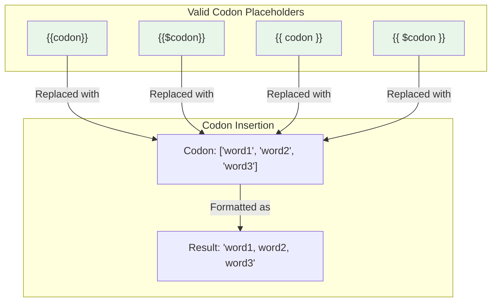
```mermaid
graph TB
    subgraph "Valid Codon Placeholders"
        P1["{{codon}}"]
        P2["{{$codon}}"]
        P3["{{ codon }}"]
        P4["{{ $codon }}"]
    end
    
    subgraph "Codon Insertion"
        C["Codon: ['word1', 'word2', 'word3']"]
        R["Result: 'word1, word2, word3'"]
    end
    
    P1 & P2 & P3 & P4 -->|Replaced with| C
    C -->|Formatted as| R
    
    style P1 fill:#e8f5e9
    style P2 fill:#e8f5e9
    style P3 fill:#e8f5e9
    style P4 fill:#e8f5e9
```

**Codon Formatting:**
- Sequons are joined with `", "` (comma-space)
- Example: `['a', 'b', 'c']` becomes `"a, b, c"`

### Lexaplast Settings

**Temperature:**
- Range: 0.0 to 2.0 (typically 0.0-1.0)
- Default: From config.ini or 0.7
- Lower = more deterministic
- Higher = more creative/random

**Num Sequons Per Codon:**
- Default: From config.ini or 3
- Can be overridden by lexaplast
- Determines how many sequons to select from lexasome

**UI Label:**
- Used for output directory name
- Default: Generated from `name` field
- Must be filesystem-safe

---

## 5. Data Flow

### Complete Generation Pipeline

```mermaid
flowchart TD
    START([Start CLI]) --> CONFIG[Load config.ini]
    CONFIG --> MODE{Select Mode}
    
    MODE -->|Interactive| INTER[Interactive Mode]
    MODE -->|Multi| MULTI[Multi Mode]
    MODE -->|Mine| MINE[Mine Mode]
    MODE -->|Housekeep| HOUSE[Housekeep Mode]
    MODE -->|Raw| RAW[Raw Mode]
    
    INTER --> SELECT_LEX[Select Lexasome(s)]
    MULTI --> SELECT_LEX
    MINE --> SELECT_LEX
    RAW --> DIRECT[Direct String Input]
    
    SELECT_LEX --> SELECT_LEXAP[Select Lexaplast]
    DIRECT --> SELECT_LEXAP
    
    SELECT_LEXAP --> LOAD[Load Files]
    LOAD --> LOOP_START{More sets?}
    
    LOOP_START -->|Yes| SEL_SEQ[Select N Sequons]
    SEL_SEQ --> FORM_COD[Form Codon]
    FORM_COD --> INSERT[Insert into Template]
    INSERT --> BUILD[Build API Prompt]
    BUILD --> API_CALL[Call LLM API]
    API_CALL --> RECEIVE[Receive Response]
    RECEIVE --> DISPLAY[Display to User]
    DISPLAY --> RATE{Rate Output?}
    
    RATE -->|Yes| SAVE[Save to JSONL]
    RATE -->|No| SAVE
    SAVE --> LOOP_START
    
    LOOP_START -->|No| SUMMARY[Show Summary]
    SUMMARY --> END([End])
    
    HOUSE --> REVIEW[Review Existing Outputs]
    REVIEW --> RATE
    
    style START fill:#c8e6c9
    style END fill:#c8e6c9
    style MODE fill:#fff9c4
    style API_CALL fill:#ffccbc
    style SAVE fill:#b3e5fc
```

### Codon Selection Process

```mermaid
flowchart TB
    subgraph "Input"
        LEX[Lexasome File]
        CONFIG[Config: N sequons]
    end
    
    subgraph "Selection Logic"
        PARSE[Parse Lexasome]
        PARSE --> TYPE{Type?}
        TYPE -->|TXT| EQUAL[Equal probability]
        TYPE -->|CSV| WEIGHT[Weighted selection]
        TYPE -->|JSON| COMBO[Combine sources]
        
        EQUAL --> MODE{Random or<br/>Consecutive?}
        WEIGHT --> MODE
        COMBO --> MODE
        
        MODE -->|Random| RAND[Random.choice with seed]
        MODE -->|Consecutive| SEQ[Sequential iteration]
    end
    
    subgraph "Output"
        RAND --> COD[Codon: [seq1, seq2, seq3]]
        SEQ --> COD
    end
    
    LEX & CONFIG --> PARSE
    
    style LEX fill:#e1f5ff
    style COD fill:#f3e5f5
    style PARSE fill:#fff9c4
```

### Template Processing

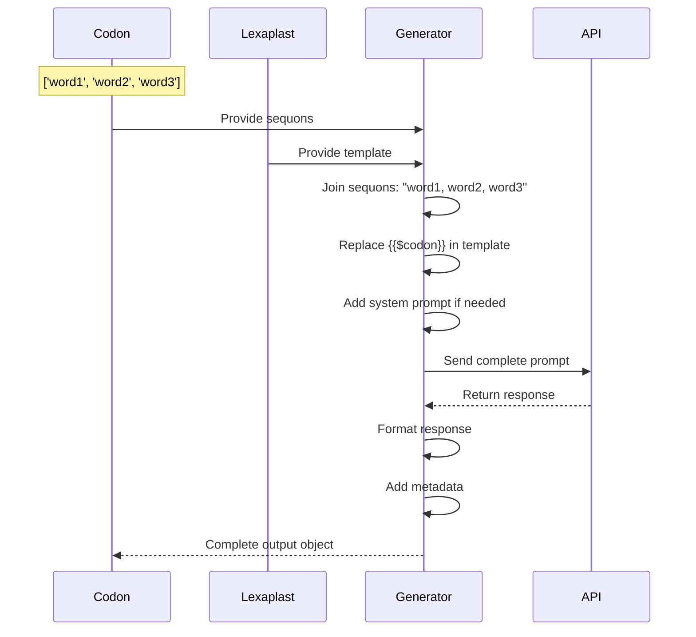
```mermaid
sequenceDiagram
    participant Codon
    participant Lexaplast
    participant Generator
    participant API
    
    Note over Codon: ['word1', 'word2', 'word3']
    
    Codon->>Generator: Provide sequons
    Lexaplast->>Generator: Provide template
    
    Generator->>Generator: Join sequons: "word1, word2, word3"
    Generator->>Generator: Replace {{$codon}} in template
    Generator->>Generator: Add system prompt if needed
    
    Generator->>API: Send complete prompt
    API-->>Generator: Return response
    
    Generator->>Generator: Format response
    Generator->>Generator: Add metadata
    Generator-->>Codon: Complete output object
```

---

## 6. Generation Modes

### Mode Comparison

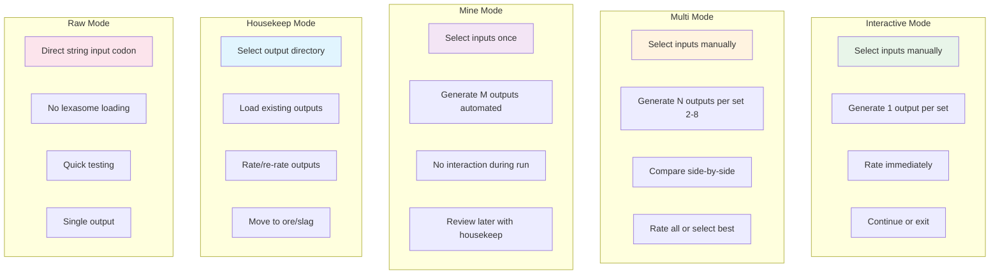
```mermaid
graph TB
    subgraph "Interactive Mode"
        I1[Select inputs manually]
        I2[Generate 1 output per set]
        I3[Rate immediately]
        I4[Continue or exit]
    end
    
    subgraph "Multi Mode"
        M1[Select inputs manually]
        M2[Generate N outputs per set 2-8]
        M3[Compare side-by-side]
        M4[Rate all or select best]
    end
    
    subgraph "Mine Mode"
        MI1[Select inputs once]
        MI2[Generate M outputs automated]
        MI3[No interaction during run]
        MI4[Review later with housekeep]
    end
    
    subgraph "Housekeep Mode"
        H1[Select output directory]
        H2[Load existing outputs]
        H3[Rate/re-rate outputs]
        H4[Move to ore/slag]
    end
    
    subgraph "Raw Mode"
        R1[Direct string input codon]
        R2[No lexasome loading]
        R3[Quick testing]
        R4[Single output]
    end
    
    style I1 fill:#e8f5e9
    style M1 fill:#fff3e0
    style MI1 fill:#f3e5f5
    style H1 fill:#e1f5fe
    style R1 fill:#fce4ec
```

### Mode Decision Tree

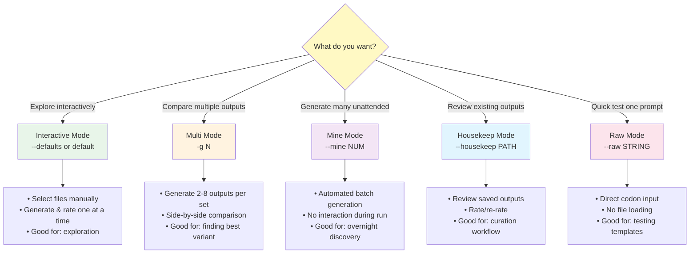
```mermaid
flowchart TD
    START{What do you want?}
    
    START -->|Explore interactively| INT[Interactive Mode<br/>--defaults or default]
    START -->|Compare multiple outputs| MULTI[Multi Mode<br/>-g N]
    START -->|Generate many unattended| MINE[Mine Mode<br/>--mine NUM]
    START -->|Review existing outputs| HOUSE[Housekeep Mode<br/>--housekeep PATH]
    START -->|Quick test one prompt| RAW[Raw Mode<br/>--raw STRING]
    
    INT --> INT_DESC["• Select files manually<br/>• Generate & rate one at a time<br/>• Good for: exploration"]
    
    MULTI --> MULTI_DESC["• Generate 2-8 outputs per set<br/>• Side-by-side comparison<br/>• Good for: finding best variant"]
    
    MINE --> MINE_DESC["• Automated batch generation<br/>• No interaction during run<br/>• Good for: overnight discovery"]
    
    HOUSE --> HOUSE_DESC["• Review saved outputs<br/>• Rate/re-rate<br/>• Good for: curation workflow"]
    
    RAW --> RAW_DESC["• Direct codon input<br/>• No file loading<br/>• Good for: testing templates"]
    
    style START fill:#fff9c4
    style INT fill:#e8f5e9
    style MULTI fill:#fff3e0
    style MINE fill:#f3e5f5
    style HOUSE fill:#e1f5fe
    style RAW fill:#fce4ec
```

### Mining Mode Deep Dive

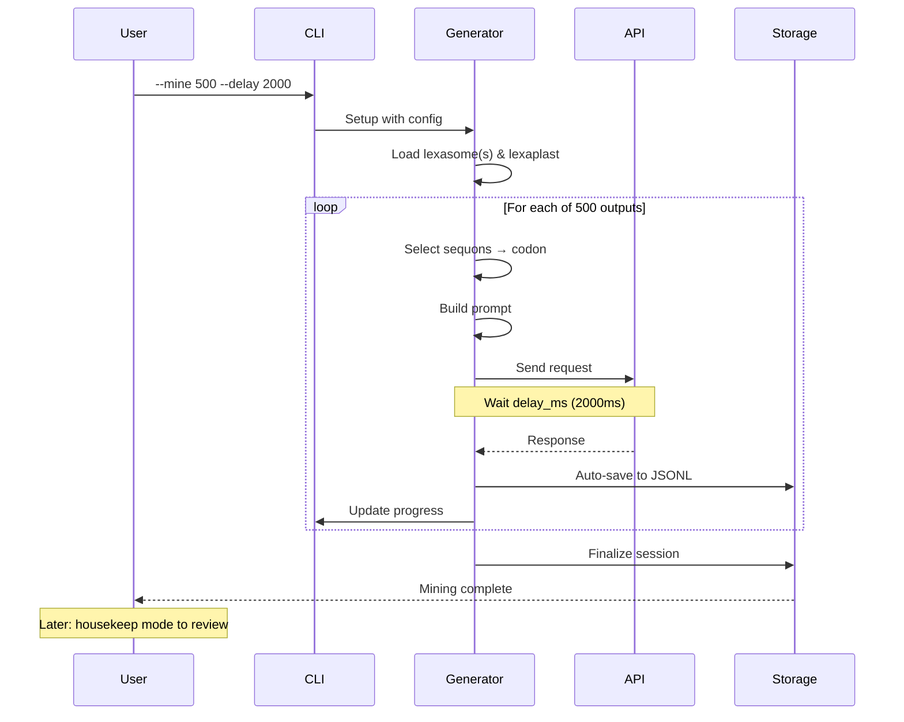
```mermaid
sequenceDiagram
    participant User
    participant CLI
    participant Generator
    participant API
    participant Storage
    
    User->>CLI: --mine 500 --delay 2000
    CLI->>Generator: Setup with config
    Generator->>Generator: Load lexasome(s) & lexaplast
    
    loop For each of 500 outputs
        Generator->>Generator: Select sequons → codon
        Generator->>Generator: Build prompt
        Generator->>API: Send request
        Note over Generator,API: Wait delay_ms (2000ms)
        API-->>Generator: Response
        Generator->>Storage: Auto-save to JSONL
        Generator->>CLI: Update progress
    end
    
    Generator->>Storage: Finalize session
    Storage-->>User: Mining complete
    
    Note over User: Later: housekeep mode to review
```

---

## 7. API Integration

### API Provider Flow

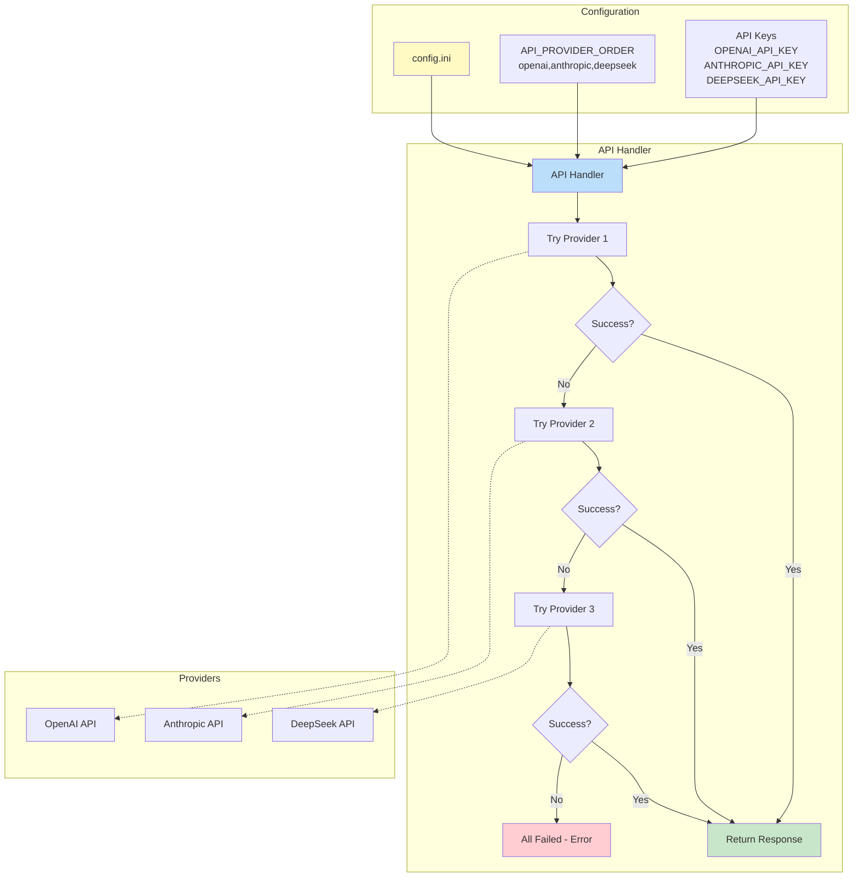
```mermaid
flowchart TB
    subgraph "Configuration"
        CONFIG[config.ini]
        ORDER["API_PROVIDER_ORDER<br/>openai,anthropic,deepseek"]
        KEYS["API Keys<br/>OPENAI_API_KEY<br/>ANTHROPIC_API_KEY<br/>DEEPSEEK_API_KEY"]
    end
    
    subgraph "API Handler"
        HANDLER[API Handler]
        HANDLER --> TRY1[Try Provider 1]
        TRY1 --> SUCCESS1{Success?}
        SUCCESS1 -->|Yes| RETURN[Return Response]
        SUCCESS1 -->|No| TRY2[Try Provider 2]
        TRY2 --> SUCCESS2{Success?}
        SUCCESS2 -->|Yes| RETURN
        SUCCESS2 -->|No| TRY3[Try Provider 3]
        TRY3 --> SUCCESS3{Success?}
        SUCCESS3 -->|Yes| RETURN
        SUCCESS3 -->|No| ERROR[All Failed - Error]
    end
    
    subgraph "Providers"
        OAI[OpenAI API]
        ANTH[Anthropic API]
        DS[DeepSeek API]
    end
    
    CONFIG --> HANDLER
    ORDER --> HANDLER
    KEYS --> HANDLER
    
    TRY1 -.-> OAI
    TRY2 -.-> ANTH
    TRY3 -.-> DS
    
    style CONFIG fill:#fff9c4
    style HANDLER fill:#bbdefb
    style RETURN fill:#c8e6c9
    style ERROR fill:#ffcdd2
```

### API Call Structure

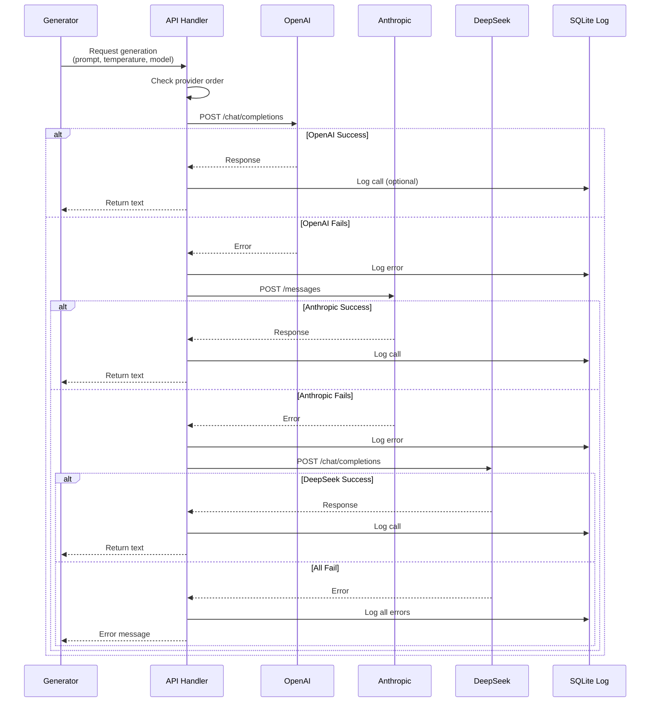
```mermaid
sequenceDiagram
    participant Gen as Generator
    participant Handler as API Handler
    participant OpenAI
    participant Anthropic
    participant DeepSeek
    participant Log as SQLite Log
    
    Gen->>Handler: Request generation<br/>(prompt, temperature, model)
    Handler->>Handler: Check provider order
    
    Handler->>OpenAI: POST /chat/completions
    
    alt OpenAI Success
        OpenAI-->>Handler: Response
        Handler->>Log: Log call (optional)
        Handler-->>Gen: Return text
    else OpenAI Fails
        OpenAI-->>Handler: Error
        Handler->>Log: Log error
        Handler->>Anthropic: POST /messages
        
        alt Anthropic Success
            Anthropic-->>Handler: Response
            Handler->>Log: Log call
            Handler-->>Gen: Return text
        else Anthropic Fails
            Anthropic-->>Handler: Error
            Handler->>Log: Log error
            Handler->>DeepSeek: POST /chat/completions
            
            alt DeepSeek Success
                DeepSeek-->>Handler: Response
                Handler->>Log: Log call
                Handler-->>Gen: Return text
            else All Fail
                DeepSeek-->>Handler: Error
                Handler->>Log: Log all errors
                Handler-->>Gen: Error message
            end
        end
    end
```

### API Request Format

**OpenAI & DeepSeek:**
```json
{
  "model": "gpt-4o",
  "messages": [
    {
      "role": "user",
      "content": "Prompt text here"
    }
  ],
  "temperature": 0.8,
  "max_tokens": 4096
}
```

**Anthropic:**
```json
{
  "model": "claude-sonnet-4-5",
  "messages": [
    {
      "role": "user",
      "content": "Prompt text here"
    }
  ],
  "temperature": 0.8,
  "max_tokens": 4096
}
```

---

## 8. Output Format

### JSONL Output Structure

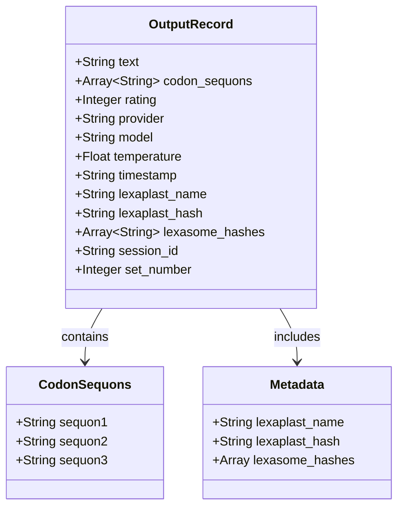
```mermaid
classDiagram
    class OutputRecord {
        +String text
        +Array~String~ codon_sequons
        +Integer rating
        +String provider
        +String model
        +Float temperature
        +String timestamp
        +String lexaplast_name
        +String lexaplast_hash
        +Array~String~ lexasome_hashes
        +String session_id
        +Integer set_number
    }
    
    class CodonSequons {
        +String sequon1
        +String sequon2
        +String sequon3
    }
    
    class Metadata {
        +String lexaplast_name
        +String lexaplast_hash
        +Array lexasome_hashes
    }
    
    OutputRecord --> CodonSequons : contains
    OutputRecord --> Metadata : includes
```

### Example Output Record

```json
{
  "text": "Generated output text goes here...",
  "codon_sequons": ["code review", "distributed systems", "concise"],
  "rating": 5,
  "provider": "openai",
  "model": "gpt-4o",
  "temperature": 0.85,
  "timestamp": "2026-03-01T13:00:00.000Z",
  "lexaplast_name": "Modelshow Prompt Generator",
  "lexaplast_hash": "sha256:abc123...",
  "lexasome_hashes": [
    "sha256:def456...",
    "sha256:ghi789..."
  ],
  "session_id": "uuid-here",
  "set_number": 1
}
```

### Output Directory Structure

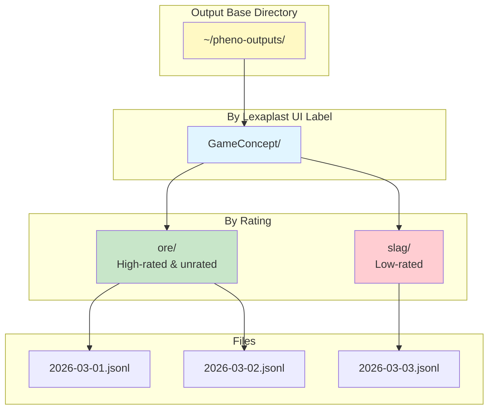
```mermaid
graph TB
    subgraph "Output Base Directory"
        BASE[~/pheno-outputs/]
    end
    
    subgraph "By Lexaplast UI Label"
        LABEL[GameConcept/]
    end
    
    subgraph "By Rating"
        ORE[ore/<br/>High-rated & unrated]
        SLAG[slag/<br/>Low-rated]
    end
    
    subgraph "Files"
        F1[2026-03-01.jsonl]
        F2[2026-03-02.jsonl]
        F3[2026-03-03.jsonl]
    end
    
    BASE --> LABEL
    LABEL --> ORE
    LABEL --> SLAG
    ORE --> F1 & F2
    SLAG --> F3
    
    style BASE fill:#fff9c4
    style LABEL fill:#e1f5ff
    style ORE fill:#c8e6c9
    style SLAG fill:#ffcdd2
```

**Directory Organization:**
```
~/pheno-outputs/
├── GameConcept/
│   ├── ore/
│   │   ├── 2026-03-01.jsonl
│   │   └── 2026-03-02.jsonl
│   └── slag/
│       └── 2026-03-01.jsonl
├── ModelshowPrompt/
│   ├── ore/
│   │   └── 2026-03-01.jsonl
│   └── slag/
└── Neologisms/
    └── ore/
        └── 2026-03-01.jsonl
```

### Rating System

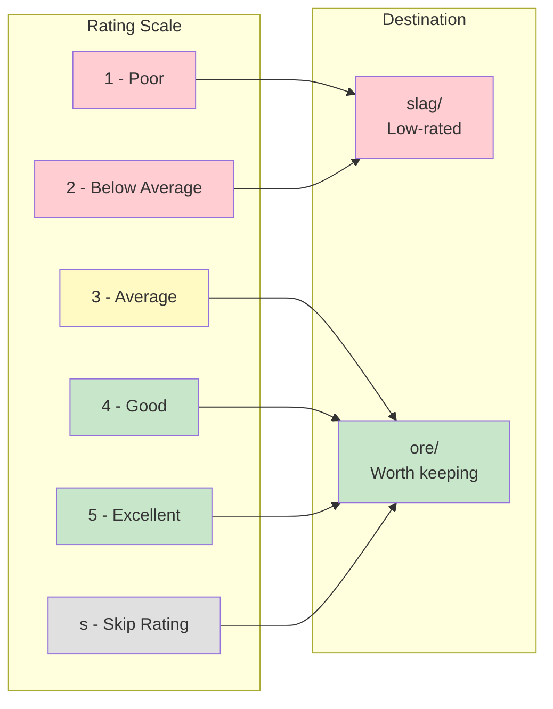
```mermaid
flowchart LR
    subgraph "Rating Scale"
        R1[1 - Poor]
        R2[2 - Below Average]
        R3[3 - Average]
        R4[4 - Good]
        R5[5 - Excellent]
        SKIP[s - Skip Rating]
    end
    
    subgraph "Destination"
        R1 & R2 --> SLAG[slag/<br/>Low-rated]
        R3 & R4 & R5 & SKIP --> ORE[ore/<br/>Worth keeping]
    end
    
    style R1 fill:#ffcdd2
    style R2 fill:#ffcdd2
    style R3 fill:#fff9c4
    style R4 fill:#c8e6c9
    style R5 fill:#c8e6c9
    style SKIP fill:#e0e0e0
    style SLAG fill:#ffcdd2
    style ORE fill:#c8e6c9
```

---

## 9. CLI Commands

### Command Structure

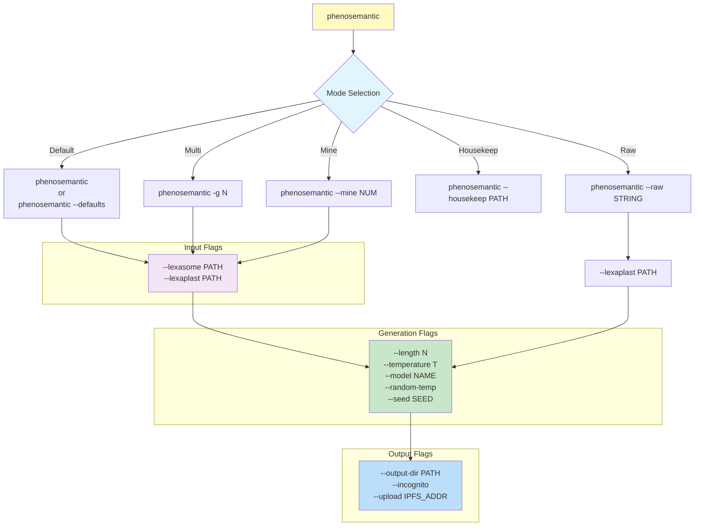
```mermaid
flowchart TB
    CLI[phenosemantic]
    
    CLI --> MODE_SELECT{Mode Selection}
    
    MODE_SELECT -->|Default| DEFAULT["phenosemantic<br/>or<br/>phenosemantic --defaults"]
    MODE_SELECT -->|Multi| MULTI["phenosemantic -g N"]
    MODE_SELECT -->|Mine| MINE["phenosemantic --mine NUM"]
    MODE_SELECT -->|Housekeep| HOUSE["phenosemantic --housekeep PATH"]
    MODE_SELECT -->|Raw| RAW["phenosemantic --raw STRING"]
    
    DEFAULT & MULTI --> INPUT_FLAGS
    MINE --> INPUT_FLAGS
    RAW --> LEXAP_FLAG
    
    subgraph "Input Flags"
        INPUT_FLAGS["--lexasome PATH<br/>--lexaplast PATH"]
    end
    
    subgraph "Generation Flags"
        GEN_FLAGS["--length N<br/>--temperature T<br/>--model NAME<br/>--random-temp<br/>--seed SEED"]
    end
    
    subgraph "Output Flags"
        OUT_FLAGS["--output-dir PATH<br/>--incognito<br/>--upload IPFS_ADDR"]
    end
    
    INPUT_FLAGS --> GEN_FLAGS
    LEXAP_FLAG["--lexaplast PATH"] --> GEN_FLAGS
    GEN_FLAGS --> OUT_FLAGS
    
    style CLI fill:#fff9c4
    style MODE_SELECT fill:#e1f5ff
    style INPUT_FLAGS fill:#f3e5f5
    style GEN_FLAGS fill:#c8e6c9
    style OUT_FLAGS fill:#bbdefb
```

### Common Command Examples

**Interactive Mode:**
```bash
# With defaults
phenosemantic --defaults

# Select files interactively
phenosemantic

# Specific files
phenosemantic --lexasome tasks.txt --lexaplast prompt.json
```

**Multi Mode (Compare Outputs):**
```bash
# Generate 4 outputs per set, compare side-by-side
phenosemantic -g 4

# With specific files
phenosemantic -g 3 --lexasome domain.txt --lexaplast template.json
```

**Mine Mode (Batch Generation):**
```bash
# Generate 100 outputs
phenosemantic --mine 100

# With delay to avoid rate limits
phenosemantic --mine 500 --delay 2000

# With random temperature
phenosemantic --mine 200 --random-temp

# Multiple lexasomes
phenosemantic --mine 100 \
  --lexasome tasks.txt \
  --lexasome constraints.csv \
  --lexasome domains.txt \
  --lexaplast prompt.json
```

**Housekeep Mode (Curation):**
```bash
# Review specific directory
phenosemantic --housekeep ~/pheno-outputs/GameConcept/ore/

# Review all from lexaplast
phenosemantic --housekeep ~/pheno-outputs/ModelshowPrompt/
```

**Raw Mode (Quick Test):**
```bash
# Test template with direct input
phenosemantic --raw "word1, word2, word3" --lexaplast prompt.json
```

### Flag Reference

```mermaid
graph TB
    subgraph "Mode Flags"
        M1["--defaults : Use default lexasome/lexaplast"]
        M2["-g, --group N : Multi-mode with N outputs"]
        M3["--mine NUM : Generate NUM outputs unattended"]
        M4["--housekeep PATH : Review existing outputs"]
        M5["--raw STRING : Direct codon input"]
    end
    
    subgraph "Input Flags"
        I1["--lexasome PATH : Specify lexasome file"]
        I2["--lexaplast PATH : Specify lexaplast file"]
        I3["--length N : Sequons per codon"]
    end
    
    subgraph "Generation Flags"
        G1["--temperature T : Override temperature"]
        G2["--model NAME : Override model"]
        G3["--random-temp : Randomize temperature per call"]
        G4["--random : Random sequon selection"]
        G5["--consecutive : Sequential selection"]
        G6["--seed NUM : Set random seed"]
        G7["--keep-seed : Don't regenerate seed"]
        G8["--delay MS : Delay between API calls"]
    end
    
    subgraph "Output Flags"
        O1["--output-dir PATH : Custom output directory"]
        O2["--incognito : Skip rating prompts"]
        O3["--upload ADDR : Publish to IPFS"]
    end
    
    subgraph "Utility Flags"
        U1["--where : Show config file location"]
        U2["--version : Show version"]
        U3["--help : Show help"]
        U4["--add-keys : Interactive key setup"]
        U5["--validate PATHS : Validate files"]
    end
    
    style M1 fill:#e8f5e9
    style I1 fill:#fff3e0
    style G1 fill:#f3e5f5
    style O1 fill:#e1f5fe
    style U1 fill:#fff9c4
```

---

## 10. Integration Patterns

### Daily Automation Pattern

```mermaid
flowchart TB
    subgraph "Nightly Cron Job 2 AM"
        CRON[Cron Trigger]
        MINE1[Mine game concepts: 200]
        MINE2[Mine prompts: 100]
        MINE3[Mine analogies: 50]
    end
    
    subgraph "Morning Workflow 9 AM"
        REVIEW[Review outputs]
        RATE[Rate with housekeep mode]
        FILTER[Filter 4-5 star outputs]
        EXTRACT[Extract to text files]
    end
    
    subgraph "Daily Usage"
        USE1[Feed concepts to main workflow]
        USE2[Test prompts with modelshow]
        USE3[Use analogies in writing]
    end
    
    CRON --> MINE1 & MINE2 & MINE3
    MINE1 & MINE2 & MINE3 --> REVIEW
    REVIEW --> RATE
    RATE --> FILTER
    FILTER --> EXTRACT
    EXTRACT --> USE1 & USE2 & USE3
    
    style CRON fill:#fff9c4
    style REVIEW fill:#e1f5fe
    style USE1 fill:#c8e6c9
```

### Multi-Agent Pipeline Integration

```mermaid
sequenceDiagram
    participant Cron
    participant Pheno as Phenosemantic
    participant Storage as JSONL Files
    participant Agent1 as Agent 1<br/>Evaluator
    participant Agent2 as Agent 2<br/>Selector
    participant Agent3 as Agent 3<br/>Builder
    
    Note over Cron: 2:00 AM Daily
    Cron->>Pheno: Mine 200 game concepts
    Pheno->>Storage: Save outputs
    
    Note over Agent1: 9:00 AM
    Agent1->>Storage: Load outputs
    Agent1->>Agent1: Evaluate concepts
    Agent1->>Agent1: Rate top 20
    
    Agent1->>Agent2: Send top concepts
    Agent2->>Agent2: Select best 5
    Agent2->>Agent3: Build games
    
    Agent3->>Agent3: Implement & deploy
```

### Feedback Loop Pattern

```mermaid
flowchart LR
    subgraph "Generation"
        LEX[Lexasome v1]
        LEXAP[Lexaplast v1]
        GEN[Generate Outputs]
    end
    
    subgraph "Curation"
        RATE[Rate Outputs]
        ANALYZE[Analyze Patterns]
    end
    
    subgraph "Refinement"
        REFINE_LEX[Refine Lexasome v2]
        REFINE_LEXAP[Refine Lexaplast v2]
    end
    
    LEX & LEXAP --> GEN
    GEN --> RATE
    RATE --> ANALYZE
    ANALYZE --> REFINE_LEX
    ANALYZE --> REFINE_LEXAP
    REFINE_LEX --> LEX
    REFINE_LEXAP --> LEXAP
    
    style ANALYZE fill:#fff9c4
    style REFINE_LEX fill:#c8e6c9
    style REFINE_LEXAP fill:#c8e6c9
```

### Skill Wrapper Pattern

```mermaid
flowchart TB
    subgraph "Custom Skill"
        SKILL[Skill Script]
        CONFIG[Skill Config]
    end
    
    subgraph "Phenosemantic Layer"
        LEX_CUSTOM[Custom Lexasomes]
        LEXAP_CUSTOM[Custom Lexaplasts]
        PHENO[Phenosemantic CLI]
    end
    
    subgraph "Integration"
        WRAPPER[Wrapper Functions]
        PARSE[Parse Outputs]
        FORMAT[Format Results]
    end
    
    SKILL --> LEX_CUSTOM & LEXAP_CUSTOM
    LEX_CUSTOM & LEXAP_CUSTOM --> PHENO
    PHENO --> WRAPPER
    WRAPPER --> PARSE
    PARSE --> FORMAT
    FORMAT --> RESULTS[Return to User]
    
    style SKILL fill:#e8f5e9
    style PHENO fill:#fff3e0
    style WRAPPER fill:#f3e5f5
    style RESULTS fill:#c8e6c9
```

---

## Summary

### Key Takeaways

**Architecture:**
- 4-layer system: Sequons → Lexasomes → Codons → Lexaplasts
- Provider-agnostic API integration with fallback
- JSONL output with full provenance

**Lexasomes (3 Types):**
- **TXT:** Unweighted list of sequons
- **CSV:** Weighted sequons (probability-based selection)
- **JSON:** Multi-source combiners with weights

**Lexaplasts:**
- JSON templates with `{{$codon}}` placeholder
- Define generation settings (temperature, model, etc.)
- Reusable across different lexasomes

**Modes:**
- **Interactive:** Explore one at a time
- **Multi:** Compare N outputs side-by-side
- **Mine:** Batch generate unattended
- **Housekeep:** Review/rate existing outputs
- **Raw:** Quick template testing

**Best Practices:**
- Start with small batches to test lexaplasts
- Use mining mode for overnight discovery
- Curate ruthlessly with housekeeping mode
- Build feedback loops: curation → refinement → better outputs
- Combine with other tools via wrapper scripts

**Integration:**
- Cron jobs for automated mining
- Multi-agent pipelines for synthesis
- Skill wrappers for domain-specific use
- IPFS publishing for provenance (optional)

---

**Document Version:** 1.0  
**Last Updated:** 2026-03-01  
**Maintained by:** Rexuvia  
**Source:** https://github.com/schbz/phenosemantic-py  

---

## Appendix: Quick Reference Card

### File Extensions
- `.txt` → Plain text lexasome (unweighted)
- `.csv` → Weighted lexasome  
- `.json` → Lexaplast OR JSON combiner

### Validation Checklist

**Lexaplast:**
- [ ] Has `template_string` key
- [ ] Contains `{{codon}}` or `{{$codon}}`
- [ ] Valid JSON format

**Lexasome (TXT):**
- [ ] At least one non-empty line
- [ ] Not a JSON file

**Lexasome (CSV):**
- [ ] Two columns: sequon, weight
- [ ] Weight is integer
- [ ] No empty rows

**Lexasome (JSON):**
- [ ] Has `name` and `sequon_sources`
- [ ] Sources array is non-empty
- [ ] Each source has `file` OR `static`

### Common Errors

**"Missing codon placeholder"**
→ Add `{{$codon}}` to lexaplast template_string

**"Invalid JSON"**
→ Check for syntax errors, trailing commas, quotes

**"Empty lexasome"**
→ Add at least one sequon to the file

**"API key not found"**
→ Run `phenosemantic --add-keys` or edit config.ini

**"File not found"**
→ Check file path, ensure it's in configured input directories

### Configuration Locations

**Config File:**
- Linux: `~/.config/phenosemantic/config.ini`
- macOS: `~/Library/Application Support/phenosemantic/config.ini`
- Windows: `C:\Users\<user>\AppData\Local\Phenosemantic\phenosemantic\config.ini`

**Find yours:**
```bash
phenosemantic --where
```

**Default Output:**
```bash
~/pheno-outputs/  # Or as configured in config.ini
```

---

*End of Technical Reference*
